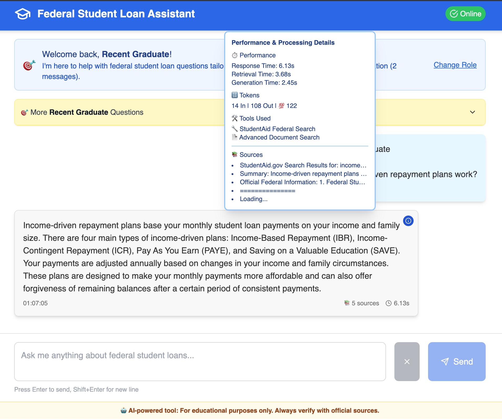
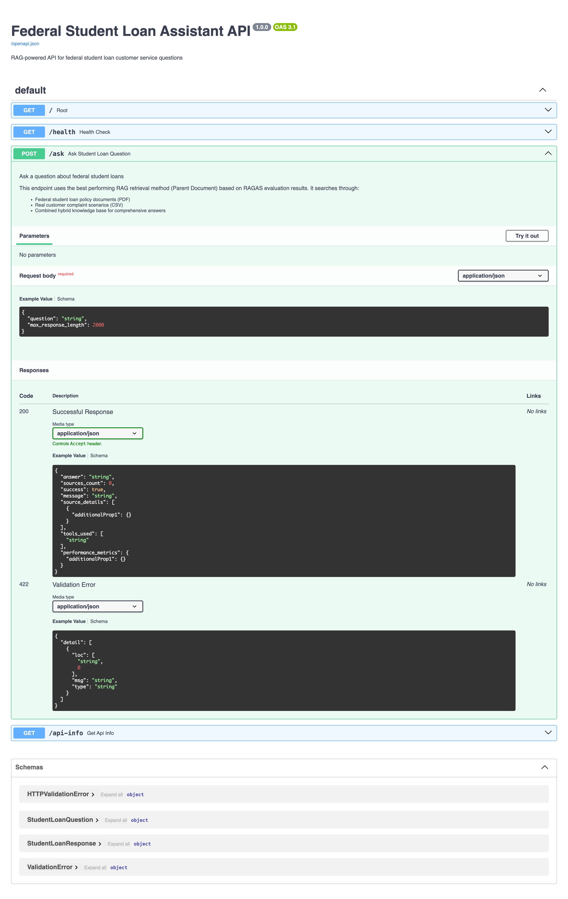
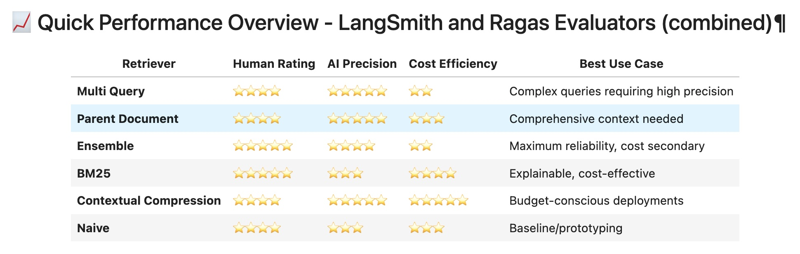

# Federal Student Loan AI Assistant   |   

<!-- Core Tech Stack -->


<!-- AI/ML/LLM Stack -->


<!-- Data & Performance -->


<!-- Performance Metrics -->


<!-- AIE7 & Certification -->


<!-- License & Social -->


---

**AIE7 Certification Challenge** - Advanced RAG system for federal student loan customer service

An intelligent assistant that combines official federal loan policies with real customer experiences to provide comprehensive guidance on student loan questions, repayment options, forgiveness programs, and servicer issues.

## Visuals

|:  :|:  :|
|:----:|:----:|

|:  :|:  :|
|:----:|:----:|

|:  :|
|:----:|

## 🚀 **New: Complete Docker Orchestration**
**Get the entire RAG system running with a single command!** All services (Vector DB + Backend API + Jupyter + Frontend) are now fully containerized with automated service management, health checks, and persistent volumes.

---

### Written report can be found [here](./docs/Report.md)
### Loom video can be found [here](https://www.loom.com/share/d89df95081c6407fbb705c03929e8f55?sid=c51a16f9-4cdb-4106-8cde-5aa344de4b63)

---

## 📖 Table of Contents

- [🚀 Quick Start](#-quick-start)
  - [1. Environment Setup](#1-environment-setup)
  - [2. Start Backend with Docker](#2-start-backend-with-docker-from-the-root-folder-of-the-project)
  - [3. Start the Frontend with Docker](#3-start-the-frontend-with-docker-new-terminal-from-the-root-folder-of-the-project)
  - [4. Open & Use the Assistant](#4-open--use-the-assistant)
- [✨ Core Features](#-core-features)
- [📁 Project Structure](#-project-structure)
- [🔗 API Usage](#-api-usage)
- [🛠 Development](#-development)
  - [Component Documentation](#component-documentation)
  - [Docker Deployment](#docker-deployment)
- [📋 Requirements](#-requirements)
  - [System Requirements](#system-requirements)
  - [Development Requirements](#development-requirements-if-not-using-docker)
    - [Backend Requirements](#backend-requirements)
    - [Frontend Requirements](#frontend-requirements)
  - [API Keys (Required)](#api-keys-required)
  - [General Environment Setup Dependencies](#general-environment-setup-dependencies)
    - [Core Tools](#core-tools)
  - [Native Environment Setup Dependencies](#native-environment-setup-dependencies)
    - [Python Dependencies (Backend)](#python-dependencies-backend)
    - [Node.js Dependencies (Frontend)](#nodejs-dependencies-frontend)
  - [Hardware Recommendations](#hardware-recommendations)
  - [Port Usage](#port-usage)
  - [Data Requirements](#data-requirements)

## 🚀 Quick Start

Get the entire RAG system running in 2 simple steps:

### 1. Environment Setup
```bash
# Copy environment template and add your API keys
cp .env-example .env

# Edit .env file with your required API keys:
# OPENAI_API_KEY=your_key_here (Required)
# COHERE_API_KEY=your_key_here (Required)  
# TAVILY_API_KEY=your_key_here (Required)
# LANGCHAIN_API_KEY=your_key_here (Optional - for tracing)
```

### 2. Start All Services with Docker
```bash
# 🌟 RECOMMENDED: Automated orchestration with health checks
./start-services.sh

# Alternative: Manual Docker Compose
docker compose up --build -d
```

**🎉 Single Command Deployment!** All services start automatically with:
- ✅ **Service Dependencies** - Proper startup ordering
- ✅ **Health Checks** - Automated service validation  
- ✅ **Data Persistence** - Volumes for cache and data
- ✅ **Network Isolation** - Dedicated Docker network
- ✅ **Multi-stage Builds** - Optimized container images

**Services Available:**
- **📊 Qdrant Vector Database**: http://localhost:6333/dashboard
- **🤖 Backend RAG API**: http://localhost:8000 
- **📚 Jupyter Lab**: http://localhost:8888
- **📖 API Documentation**: http://localhost:8000/docs
- **🎨 Frontend Dashboard**: http://localhost:3000

### ⏹️ Stop All Services
```bash
# 🛑 Graceful shutdown with automatic cleanup (preserves data)
./stop-services.sh                    # Stops services + cleans dangling images

# 🗑️ Advanced shutdown options  
./stop-services.sh --remove          # Also removes containers + cleans images
./stop-services.sh --clean           # Full cleanup (⚠️ removes all data)

# 🔧 Alternative: Direct Docker Compose
docker compose down
```

### 📊 **Initialization Progress**
The system loads a **hybrid dataset** (749 documents → 2,172 chunks → vector embeddings):
- **⏱️ Startup Time**: 60-90 seconds for full RAG agent initialization
- **📈 Progress Monitoring**: Watch logs via `docker compose logs -f backend`
- **🎯 Ready Indicator**: Backend health endpoint returns `"status": "healthy"`

### 🔧 Service Management
```bash
# View logs for all services
docker compose logs -f

# View logs for specific service
docker compose logs -f backend
docker compose logs -f jupyter
docker compose logs -f frontend
docker compose logs -f qdrant

# Check service health status
docker compose ps

# Restart specific service  
docker compose restart backend

# 🧹 Automatic cleanup features (built-in)
./start-services.sh              # Auto-cleans dangling images & build cache before start
./stop-services.sh               # Auto-cleans dangling images after stop
./stop-services.sh --remove      # Stop + remove containers + clean images
./stop-services.sh --clean       # Full cleanup including all data volumes

# Scale services (if needed)
docker compose up --scale backend=2 -d
```

### 3. Open & Use the System
Once all services are running, you can access:

- **🎨 Frontend Dashboard**: http://localhost:3000 - Interactive chat with persona-based interactions
- **📚 Jupyter Notebooks**: http://localhost:8888 - RAG experiments and analysis
- **📖 API Documentation**: http://localhost:8000/docs - REST API endpoints
- **📊 Qdrant Dashboard**: http://localhost:6333/dashboard - Vector database monitoring

### 🎭 **Frontend Features**
The web interface includes advanced persona-based interactions:

- **👥 Multi-Persona Support**: Student, Parent, Financial Counselor, Loan Servicer roles
- **📝 Context-Aware Questions**: Pre-built question templates per persona
- **💬 Session Management**: Persistent chat sessions across role changes
- **📊 Performance Transparency**: Response times, token usage, and source relevance scores
- **🎨 Professional UI**: Clean design with role-specific styling and tooltips
- **⚡ Real-time Responses**: Live streaming of responses with cancel functionality

### 4. Running RAG Experiments

#### Option 1: Using Docker (Recommended)
```bash
# Jupyter is already running at http://localhost:8888
# Open the notebooks directly in your browser
```

#### Option 2: Local Development
```bash
# Install dependencies locally
uv sync

# Start Jupyter from project root
uv run jupyter lab
```

When inside Jupyter Labs, you can access the main evaluation notebook:
- [Agentic RAG evaluation experiments.ipynb](./notebooks/Agentic%20RAG%20evaluation%20experiments.ipynb)

## ✨ Core Features

### 🎯 **AI-Powered Student Loan Expertise**
- **Federal Loan Expert** - Trained on official policies + real customer complaints
- **Multi-Persona Interface** - Role-based interactions (Student, Parent, Counselor, etc.)
- **Context-Aware Responses** - Understands user focus and provides targeted guidance
- **Source Transparency** - Shows relevance scores and document sources for all answers

### 🔍 **Advanced RAG Architecture** 
- **Hybrid Dataset** - PDF policies + CSV complaints for comprehensive knowledge
- **Multiple Retrieval Methods** - Naive, Multi-Query, Parent-Document, Contextual Compression
- **Agent Orchestration** - LangGraph-based tool selection and workflow management
- **Performance Evaluation** - RAGAS metrics with comprehensive benchmarking

### 🚀 **Production-Ready Deployment**
- **Complete Docker Orchestration** - Multi-service containerization with health checks
- **One-Command Deployment** - Automated service management and startup
- **Auto-Scaling Architecture** - Horizontal scaling with load balancing support
- **Real-time Monitoring** - Qdrant dashboard, health endpoints, and comprehensive logging

### 💬 **Enhanced User Experience**
- **Interactive Chat Interface** - Clean, responsive web interface with session management
- **Role-Based Personas** - Tailored question templates and response styles
- **Performance Metrics** - Real-time response times, token usage, and source tracking
- **RESTful API** - Production-ready `/ask` endpoint with comprehensive metrics

## 📁 Project Structure

```
├── 📁 Core Application
│   ├── src/backend/              # FastAPI server with RAG endpoint
│   ├── src/core/                 # RAG retrieval implementations
│   ├── src/agents/               # LangGraph agent orchestration
│   └── src/utils/                # Utilities and helper functions
├── 🎨 Frontend
│   └── frontend/                 # Next.js chat interface  
├── 📊 Data & Analysis
│   ├── data/                     # Federal loan PDFs + complaints CSV
│   ├── notebooks/                # Jupyter research & evaluation
│   ├── golden-masters/           # Generated test datasets
│   └── metrics/                  # Performance evaluation results
├── 🐳 Docker Infrastructure
│   ├── docker-compose.yml        # Multi-service orchestration
│   ├── start-services.sh         # Automated deployment script
│   ├── stop-services.sh          # Graceful shutdown script
│   └── setup.sh                  # Development setup utilities
├── 📚 Documentation
│   ├── docs/                     # Project documentation
│   ├── README.md                 # Main project documentation
│   └── CLAUDE.md                 # Development guidelines
└── ⚙️ Configuration
    ├── .env-example              # Environment variables template
    ├── pyproject.toml            # Python dependencies (uv)
    └── uv.lock                   # Locked dependency versions
```

## 🔗 API Usage

**POST** `/ask` - Ask any federal student loan question
```json
{
  "question": "What are income-driven repayment plans?",
  "max_response_length": 2000
}
```

**Response includes:**
- Generated answer with contextual sources and relevance scores
- Comprehensive performance metrics (response time, tokens used, retrieval method)
- Source document transparency with relevance scoring
- Tool usage tracking and agent decision logs

## 🛠 Development

This project implements cutting-edge RAG techniques with comprehensive evaluation:

### 🧪 **Advanced RAG Research**
- **Hybrid Dataset**: Official policies + real customer scenarios (4,547 → 825 → 480 quality-filtered records)
- **Multiple Retrievers**: Naive (best performer), Multi-Query, Parent-Document, Contextual Compression
- **Agent Framework**: LangGraph with StateGraph orchestration and tool selection
- **Evaluation Pipeline**: RAGAS metrics with 6 core measurements (all higher=better scale)

### 📊 **Performance Analysis**
- **Retrieval Ranking**: Comprehensive benchmarking across all methods
- **Visualization Tools**: Heatmap generation for metric pattern analysis  
- **Golden Master datasets**: Cached evaluation datasets to avoid regeneration
- **Performance Tracking**: Response times, token usage, and retrieval quality metrics

### 🔬 **Research Notebooks**
- **Agentic RAG Evaluation**: Main notebook for agent-based experiments
- **Retriever Comparison**: Traditional retrieval method benchmarking
- **Performance Visualization**: Heatmap and metric analysis tools

### Component Documentation
- **Backend Details**: [`src/backend/README.md`](src/backend/README.md)
- **Frontend Setup**: [`frontend/README.md`](frontend/README.md)

### Docker Architecture

**🏗️ Multi-Service Architecture:**
- **Qdrant** (Vector Database) - Persistent storage for embeddings
- **Backend** (FastAPI + RAG Agent) - Python API with LangGraph orchestration  
- **Jupyter** (Analysis Environment) - Notebook server for experiments
- **Frontend** (Next.js) - React-based chat interface

**🔧 Advanced Features:**
- **Multi-stage Docker builds** with uv for optimized Python dependencies
- **Service health checks** with automatic restart policies
- **Persistent volumes** for data, cache, and Jupyter notebooks
- **Network isolation** with dedicated Docker network
- **Environment-based configuration** for local/production deployment

**🚀 Deployment Options:**
```bash
# 🌟 Recommended: Full orchestration
./start-services.sh

# Manual: Individual services
docker compose up qdrant backend jupyter frontend -d

# Development: Backend + Qdrant only
docker compose up qdrant backend -d
```


## 📋 Requirements

### System Requirements
- **Docker** (20.10+) - For containerized deployment
- **Docker Compose** (2.0+) - For multi-container orchestration  
- **Git** (2.25+) - For cloning the repository
- **Modern Browser** - Chrome, Firefox, Safari, or Edge
- **Memory**: 4GB+ RAM (8GB+ recommended for optimal performance)
- **Storage**: 3GB+ free space (for images, data, and dependencies)

### Development Requirements (if not using Docker)

#### Backend Requirements
- **Python 3.11+** (tested with 3.11, minimum 3.8)
- **System Dependencies** (for native installation):
  - `gcc` and `g++` (build tools)
  - `curl` (for health checks)
  - `build-essential` (Linux/WSL)

#### Frontend Requirements  
- **Node.js 18+** with npm
- **Next.js 14.2+** (React framework)
- **TypeScript 5.1+** (for type safety)

### API Keys (Required)
Create a `.env` file in the project root with:
```bash
# Required API Keys
OPENAI_API_KEY=your_openai_key_here          # For LLM and embeddings
COHERE_API_KEY=your_cohere_key_here          # For reranking functionality

# Optional API Keys
TAVILY_API_KEY=your_tavily_key_here          # For external search (optional)
LANGCHAIN_API_KEY=your_langsmith_key_here    # For tracing/monitoring (optional)
```

### General environment setup dependencies

#### Core Tools
- **Git** (2.25+) - Version control and repository cloning
- **Docker** (20.10+) - Container runtime and orchestration
- **Docker Compose** (2.0+) - Multi-container application management
- **curl** or **wget** - For API testing and health checks

### Native environment setup dependencies
#### Python Dependencies (Backend)
The backend requires 50+ Python packages including:
- **AI/ML**: `langchain`, `langgraph`, `openai`, `cohere`, `ragas`
- **Vector DB**: `qdrant-client`, `langchain-qdrant`
- **Document Processing**: `pypdf2`, `pymupdf`, `unstructured`
- **Web Framework**: `fastapi`, `uvicorn`, `pydantic`
- **Data Science**: `numpy`, `pandas`, `matplotlib`, `seaborn`
- **Search**: `tavily-python`, `rank-bm25`
- **Utilities**: `python-dotenv`, `joblib`, `tqdm`

#### Node.js Dependencies (Frontend)
- **React 18.2+** with Next.js framework
- **UI Components**: `lucide-react` (icons)
- **Styling**: `tailwindcss`, `autoprefixer`, `postcss`
- **Development**: TypeScript, ESLint, development server

### Hardware Recommendations
- **Memory**: 4GB+ RAM (8GB+ recommended for better performance)
- **Storage**: 2GB+ free space for dependencies and data
- **CPU**: Multi-core processor recommended for faster RAG processing
- **Network**: Stable internet connection for API calls

### Port Usage
| Service | Port | URL | Purpose |
|---------|------|-----|----------|
| **Qdrant** | 6333 | http://localhost:6333/dashboard | Vector database dashboard |
| **Backend API** | 8000 | http://localhost:8000 | RAG API endpoints |
| **API Documentation** | 8000 | http://localhost:8000/docs | OpenAPI/Swagger docs |
| **Jupyter Lab** | 8888 | http://localhost:8888 | Notebook environment |
| **Frontend** | 3000 | http://localhost:3000 | Web interface |

**🔒 Network Configuration:**
- All services run on isolated Docker network `student-loan-network`
- Only necessary ports exposed to host machine
- Internal service communication via Docker DNS

### Data Requirements & Architecture

**📊 Hybrid Dataset Pipeline:**
```
📄 PDF Documents (4 files, ~4MB)
     ↓ DirectoryLoader + PyMuPDFLoader
   269 PDF pages
     ↓ RecursiveCharacterTextSplitter (750 chars)
   615 PDF chunks

📊 CSV Complaints (~12MB)
     ↓ CSVLoader + Quality Filtering  
4,547 raw → 825 loaded → 480 filtered (58% retention)
     ↓ RecursiveCharacterTextSplitter (750 chars)
 1,557 CSV chunks

     ↓ Combined Hybrid Dataset
 2,172 total chunks → OpenAI Embeddings → Qdrant Vector Store
```

**🎯 Quality Filtering (Complaints):**
- ❌ **Narratives < 100 characters** (34 removed)
- ❌ **Excessive redaction (>5 XXXX tokens)** (311 removed)  
- ❌ **Empty/None/N/A content** (0 removed)
- ✅ **Final retention**: 58.2% (480/825 loaded records)

**💾 Storage & Memory:**
- **Vector embeddings**: ~39.2MB in Qdrant (in-memory)
- **Docker volumes**: Persistent cache, data, and notebooks
- **Total footprint**: ~2GB including all container images

### 🚀 **Performance & Scaling**

**⚡ Response Times (Typical):**
- **RAG Query Processing**: 3-8 seconds
- **Backend Initialization**: 60-90 seconds  
- **Container Startup**: 10-30 seconds per service

**📈 Throughput Capabilities:**
- **Concurrent Users**: 10-50 (single backend instance)
- **Vector Search**: Sub-second retrieval from 2,172 chunks
- **Memory Usage**: ~500MB per backend container

**🔧 Scaling & Maintenance:**
```bash
# Scale backend for higher throughput
docker compose up --scale backend=3 -d

# Production: External Qdrant cluster
export QDRANT_URL=http://your-qdrant-cluster:6333
./start-services.sh

# 🧹 Automatic disk space management
# Both scripts include automatic cleanup of:
# - Dangling Docker images (unused image layers)
# - Build cache (intermediate build steps)
# - Orphaned containers (from previous runs)

# 📊 Monitor disk usage
docker system df                     # Show Docker disk usage
docker images | grep student-loan    # Show project images
```

---

**Ready to help students navigate federal loan complexities with AI-powered guidance!** 🎓
