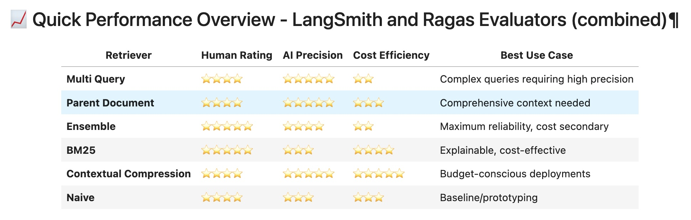

## Task 1: Defining the Problem and Audience
**✅ Deliverables**

1. Write a succinct 1-sentence description of the problem

* **Problem:** It is hard to get clear, precise answers to questions about student loans and student loan repayment for existing borrowers and potential borrowers, even as a customer service agent within a federal student loan company like [Mohela](https://www.mohela.com/) and [Federal Student Aid](https://studentaid.gov/)

2. Write 1-2 paragraphs on why this is a problem for your specific user

* **Why:**  
  1. As student loan repayment continues this summer, the volume of calls is expected to increase in 2025
  2. As of Q1, 2025, there is $1.777T USD in student loan debt, including $1.693T in Federal student loan debt, affecting 42.7M people in the US
  3. Dr. Greg has student loans, and so this is a problem that is interesting and important to him
* **Success:** Time saved by responding to customer inquiries and complaints
  1. 🧪 Hypothesis: The existing tooling used for search, retrieval, and generation of helpful and useful answers to customer inquiries does not rapidly accelerate an agent’s ability to deal with a large volume of customer complaints per day
* **Audience:** We are building this application for customer service agents who work in Federal Student Loan companies

## Task 2: Proposed Solution
**✅ Deliverables**

1. Write 1-2 paragraphs on your proposed solution.  How will it look and feel to the user?

* **Solution**: We are building a solution that can answer questions like:

| Category | Scenario / Question |
| :---- | ----- |
| **Existing borrowers in repayment** | Customer is complaining that they are unable to pay and they are already 3 months behind on payments – what is the best solution? |
| **Existing borrowers in repayment** | Customer asserts that they did fill out an Income-Driven Repayment (IDR) plan renewal form, but there is none on record. Customer is insistent. What is the best solution? |
| **Existing borrowers in repayment** | Customer asserts “I shouldn’t have to pay these back – this is unconstitutional.” How do I respond? |
| **New borrowers** | Is applying for and securing a student loan in 2025 a terrible idea? |
| **New borrowers** | How much loan money can I actually get from the government to go to school these days? Is there a cap? |
| **New borrowers** | What grants and scholarships are available for free? |


2. Describe the tools you plan to use in each part of your stack.  Write one sentence on why you made each tooling choice.
    1. LLM
    2. Embedding Model
    3. Orchestration
    4. Vector Database
    5. Monitoring
    6. Evaluation
    7. User Interface
    8. (Optional) Serving & Inference

Technology Stack Choices

- LLM: GPT-4 (gpt-4.1, gpt-4o-mini, gpt-4o-nano) - Excellent at understanding complex policy language and generating, and each of them have their expertise as per their individual strenghs. And all of them can perform customer-appropriate explanations while maintaining accuracy with citations. As Chris said they need to do a bit of thinky-thinky, hence ones that can reason well are include. For e.g. their strengths go from strong to week for these models respectively: pt-4.1, gpt-4o-mini, gpt-4o-nano
- Embedding Model: OpenAI `text-embedding-3-small` and `text-embedding-3-large` - the usual choice of a embeddings model with strong performance on documents and text
- Orchestration: LangGraph - Enables complex multi-agent workflows for our agentic RAG to run our tools, eventhough we have used only simple graphs
- Vector Database: Qdrant - as we have been using during our sessions and satisfies the basic requirements of storing chunks and searching documents, also code to use it integrated with the retrievers were already avail to use
- Monitoring: LangSmith - Built-in tracing for agent workflows, essential for debugging tool calls and measuring response quality in customer service context, in case we learn monitoring using LangSmith
- User Interface: Streamlit or Cursor/Claude Code generate front-end + Docker - rapid prototyping for agent-facing dashboard with real-time chat
- Evaluation: RAGAS - Industry standard for RAG evaluation with metrics that align with accuracy and relevance requirements for Student Loan responses
- Serving & Inference: FastAPI + Docker - Production-ready deployment with session management between user sessions, fully satisfies our requirements allowing us a quick go-to-market

3. Where will you use an agent or agents?  What will you use “agentic reasoning” for in your app?

- _Simplified Agentic Reasoning Strategy: Smart Customer Service Assistant_
Primary Agent: Federal Student Loan Assistant
- Core Function: Intelligent question processing with context-aware tool selection and response generation
- Tool Arsenal: Policy and Complaints document retrieval, external search engine service(s) (loan specific sites and also general search engine searches)

Agentic Reasoning Within Single Agent: Smart Tool Orchestration & Contextual Routing

  The agent intelligently analyzes each user query to determine its type and complexity. It then orchestrates a mix of
  internal and external tools:

   * Internal RAG Tools: Prioritized for questions answerable by the project's hybrid knowledge base (federal policies,
      customer complaints). This includes specialized RAG method like Parent-Document (only using one method as per RAGAS Evaluation outcome)
   * External Search Tools: Utilized for information beyond the internal dataset, such as official federal guidance
     (StudentAid.gov), servicer-specific details (Mohela), comprehensive loan comparison service (StudentAid & Mohela combined), or broader web searches (using Tavily).

  This dynamic routing ensures the most relevant and authoritative information source is consulted, adapting to the query's specific needs.

Why Single Agent Works?:
- Sufficient Complexity: The agentic behavior comes from intelligent tool orchestration and orchestrating multiple tools, not from multiple specialized agents
- Clear Workflow: _Question_ → _Analyze_ → _Retrieve_ → _Synthesize_ → _Respond_ (with escalation branching) - linear enough for one agent to handle effectively

## Task 3: Dealing with the Data

**✅ Deliverables**

1. Describe all of your data sources and external APIs, and describe what you’ll use them for.

_Data Sources_

All the files in the `data` folder are our dataset, shared during the covert:
- four PDF files 
  - Academic_Calenders_Cost_of_Attendance_and_Packaging.pdf
  - Applications_and_Verification_Guide.pdf
  - The_Direct_Loan_Program.pdf
  - The_Federal_Pell_Grant_Program.pdf
- one complains.csv file (14K records)

2. Describe the default chunking strategy that you will use.  Why did you make this decision?

_Chunking strategy_

The simplest chunking strategy has been used:
```python
### taking advise from and also reviewing all the code and notebooks shared on RAG and works (legacy implementation)
text_splitter = RecursiveCharacterTextSplitter(chunk_size=750, chunk_overlap=100)
```
One of the analysis from an LLM suggested for the type of data/documents present in the `data` folder the below is the most optimised one to have for the child splitter:
```python
child_splitter = RecursiveCharacterTextSplitter(chunk_size=512, chunk_overlap=50)
```

Although the above config didn't help but deteriorated the metrics (scores) for the Parent Docoment retriever.

While the Parent Docoment retriever can be setup this way:
```python
parent_text_splitter = RecursiveCharacterTextSplitter(chunk_size=750 chunk_overlap=100) ### as other retrievers and same as child splitter

child_text_splitter = RecursiveCharacterTextSplitter(chunk_size=750 chunk_overlap=100)
```

## Task 4: Building a Quick End-to-End Agentic RAG Prototype

**✅ Deliverables**
- Build an end-to-end prototype and deploy it to a local endpoint
See [AIE7-Cert-Challenge](https://github.com/neomatrix369/AIE7-Cert-Challenge) | [README](https://github.com/neomatrix369/AIE7-Cert-Challenge/blob/main/README.md) | [Frontend README](https://github.com/neomatrix369/AIE7-Cert-Challenge/blob/main/frontend/README.md) | [Backend README](https://github.com/neomatrix369/AIE7-Cert-Challenge/blob/main/src/backend/README.md)

---

---

**Other screenshots:** [Swagger UI](../screenshots/swagger-ui-screenshot.png) | [Frontend blocking terminal/console](../screenshots/terminal-screen-frontend-app.jpg) | [Backend blocking terminal/console](../screenshots/terminal-screen-backend-app.jpg)

## Task 5: Creating a Golden Test Data Set

**✅ Deliverables**
1. Assess your pipeline using the RAGAS framework including key metrics faithfulness, response relevance, context precision, and context recall.  Provide a table of your output results.
_[TBC once experiments are complete]_

2. What conclusions can you draw about the performance and effectiveness of your pipeline with this information?
_[TBC once experiments are complete]_

## Task 6: The Benefits of Advanced Retrieval

**✅ Deliverables**
1. Describe the retrieval techniques that you plan to try and to assess in your application. Write one sentence on why you believe each technique will be useful for your use case.
_[TBC once experiments are complete]_
Use the outcomes of the HW09 as justification on which method is use and why?

2. Test a host of advanced retrieval techniques on your application.
_[TBC once experiments are complete]_

## Task 7: Assessing Performance

**✅ Deliverables**
1. How does the performance compare to your original RAG application?  Test the advanced retrieval method using the RAGAS frameworks to quantify any improvements.  Provide results in a table.

Below is the screenshot of the heatmap of the RAGAS evaluation of the selected four retrievers:


Initially used the usual naive retriever as the baseline and then progress to the others and finally settled for Parent Document retriever as you can see its quite a contender and for the combined (4 PDFs + 1 csv) dataset file, it rose up like a phoenix!

This is still pending a new experiment, which will decide if Parent Document retriever can hold onto that top position! The new experiment will have better chunking strategy and also additional metrics to scrutinise each of the retrievers.

See also [another experiement](https://github.com/neomatrix369/AIE7/blob/s09-assignment/09_Advanced_Retrieval/Combining%20evaluations%20LangSmith%20and%20Ragas.ipynb) performed using similar data:


2. Articulate the changes that you expect to make to your app in the second half of the course. How will you improve your application?
_[TBC everything is complete]_